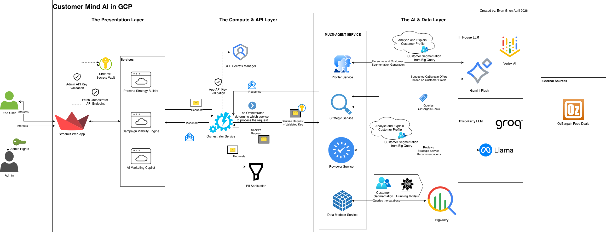

# 🧠 Customer Intelligence Platform: Multi-Agent AI Architecture

## 🎯 Overview

This repository contains the source code for an enterprise-grade, event-driven AI Data Platform. It bridges the gap between traditional data engineering and generative AI by utilizing a **Distributed Microservices Architecture** to host autonomous reasoning agents on **Google Cloud Platform**.

Rather than a simple chatbot, this platform functions as a "Human-in-the-Loop" recommender system and analytics engine. It empowers marketing teams to generate hyper-personalized campaigns, forecast audience viability using **BigQuery ML**, and query the data warehouse using natural language.

-----

## 🏗️ Core Capabilities

1.  **🎯 Persona Strategy Builder (Tab 1)**

      * **Goal:** Transform raw demographics into psychological profiles.
      * **Tech:** RAG pipeline extracting BigQuery entities, validated by a **Llama 3.3 (Groq)** compliance auditor for sub-second safety checks.

2.  **📊 Campaign Viability Engine (Tab 2)**

      * **Goal:** Validate market offers against the database to forecast reach.
      * **Tech:** Uses **BigQuery ML (`ML.PREDICT`)** for K-Means clustering, materialized into a semantic view (`v_agent_semantic_layer`) to minimize LLM latency.

3.  **💬 AI Marketing Copilot (Tab 3)**

      * **Goal:** Self-service analytics via Text-to-SQL.
      * **Tech:** **Vertex AI Multi-Tool Agent** (Gemini 2.5) that autonomously chooses tools to scrape OzBargain RSS feeds, write SQL, and synthesize strategic insights.

-----

## ⚙️ System Architecture & Design Patterns


**Core Stack:**


### The Microservices (The "Spokes")

This system utilizes a decoupled FastAPI backend. Detailed logic for each service is located in their respective sub-directories:

  * 📂 **[`01_data_foundations/`](https://www.google.com/search?q=./01_data_foundations)**: **Data Layer**. SQL schemas for feature engineering and raw data bootstrapping.
  * 📂 **[`02_predictive_layer/`](https://www.google.com/search?q=./02_predictive_layer)**: **ML Layer**. BQML K-Means training, evaluation, and semantic layer materialization.
  * 📂 **[`03_agentic_ai/`](https://www.google.com/search?q=./03_agentic_ai)**: **Application Layer**. Contains the 5 core Python microservices:
      * `orchestrator_service`: The API Gateway and state manager.
      * `strategist_service`: The Vertex AI Reasoning Engine.
      * `reviewer_service`: The Llama 3.3 Compliance Auditor.
      * `data_modelling_service`: The BigQuery Execution & MLOps Engine.
      * `profiler_service`: The Vertex AI Persona Generator.

### 🛡️ Enterprise Security & Guardrails

  * **IAM Isolation:** Service accounts adhere to the principle of least privilege *(i.e. restricted to BigQuery Data Editor for MLOps materialization and Data Viewer for standard querying)*
  * **Regex Bouncers:** Backend intercepts and blocks destructive keywords (`DROP`, `DELETE`, `UPDATE`).
  * **Compute Seatbelts:** Forced `LIMIT 100` and `maximum_bytes_billed` settings to prevent billing spikes.
  * **Zero-Trust Deployment:** Secrets are injected at runtime via **GCP Secret Manager**; no keys exist in the codebase.

-----

## 🚀 Quick Start (Local Development)

### 1. Environment Setup

This project uses **Poetry** for dependency management.

```bash
git clone https://github.com/yourusername/customer-intelligence-platform.git
cd customer-intelligence-platform

# Install dependencies
poetry install

# Configure environment
cp .env.example .env
```

### 2. Authentication

Authenticate your local environment with Google Cloud:

```bash
gcloud auth application-default login
```

### 3. Launching Services

To run the platform locally, launch the microservices and the UI using Poetry:

```bash
# Terminal 1: Launch Orchestrator (Backend Gateway)
poetry run uvicorn 03_agentic_ai.app.agents.orchestrator_service.main:app --port 8000 --reload

# Terminal 2: Launch Streamlit UI
poetry run streamlit run streamlit_app.py
```

*(Repeat for individual agent services as needed on ports 8001-8004).*

-----

## ☁️ Deployment

The platform is architected for **Google Cloud Run**. Each service is deployed as a stateless container, scaling to zero when inactive to optimize costs.

```bash
# Example Cloud Run Deployment
gcloud run deploy orchestrator-service \
  --source . \
  --region australia-southeast1 \
  --set-secrets="API_KEY=customermind-api-key:latest"
```

-----

### 🚀 Future Roadmap: From POC to Production

If you document these considerations, categorize them into three engineering "Epics":

#### 1. Data Architecture Evolution (The "Data Sleuth" Feedback)
* **Current State:** The POC relies on static demographic snapshots (Age, Income) for baseline clustering.
* **Production Consideration:** Shift to a **Behavioral Event-Driven Architecture**. We will expand the BigQuery schema to ingest time-series historical engagement logs (click-through rates, past purchases, session duration). 
* **Geospatial Integration:** Add native Latitude/Longitude data types to BigQuery to allow the AI to perform geospatial querying (e.g., "Find high-LTV customers within 5km of our Sydney flagship store").

#### 2. Advanced MLOps & Predictive Modeling (The "CMO" Feedback)
* **Current State:** Unsupervised K-Means clustering for basic persona grouping.
* **Production Consideration:** Transition to **Predictive ROI Modeling**. Instead of just grouping users, we will train supervised models (e.g., XGBoost or deep learning on Vertex AI) to predict Customer Lifetime Value (LTV) and Conversion Likelihood. 
* **The Goal:** The Campaign Viability Engine will use these predictions to rank strategies by *Expected Revenue*, directly addressing the CMO's request for ROI prioritization.

#### 3. Seamless UI Orchestration 
* **Current State:** Distinct, separate tabs for Persona Building and Campaign Viability.
* **Production Consideration:** Implement a unified state-management flow in the frontend. When a user generates a Persona, the Orchestrator Service will automatically trigger the Campaign Viability model in the background, surfacing predicted ROI scores directly on the Persona card.

-----

## 📊 Data Acknowledgement & Disclaimer

**Synthetic Data Generation:**
The massive dataset utilized in this demonstration was synthetically generated and scaled (via zero-collision UUIDs) to simulate an enterprise-scale data warehouse environment. 

**Original Seed Data:**
The base schema, statistical distributions, and initial seed data were derived from the [Customer Personality Analysis Dataset](https://www.kaggle.com/datasets/imakash3011/customer-personality-analysis/data) provided by Akash on Kaggle. 

**Live Campaign Feed (OzBargain):**
The real-time product offers and deals utilized by the Strategist LLM to craft hyper-relevant campaigns are sourced from the [OzBargain](https://www.ozbargain.com.au/) RSS feed. OzBargain is Australia's premier bargain-hunting and deal-sharing community. All deal data, product names, and associated trademarks belong to their respective owners and the original community posters.

*Disclaimer: This project is a technical proof-of-concept for Multi-Agent cloud architecture. The customer data is entirely synthetic, the generated personas/campaigns do not reflect real individuals, and this project is not officially affiliated with or endorsed by OzBargain.*


-----

## 📄 License

This project is licensed under the MIT License - see the [LICENSE](LICENSE) file for details.